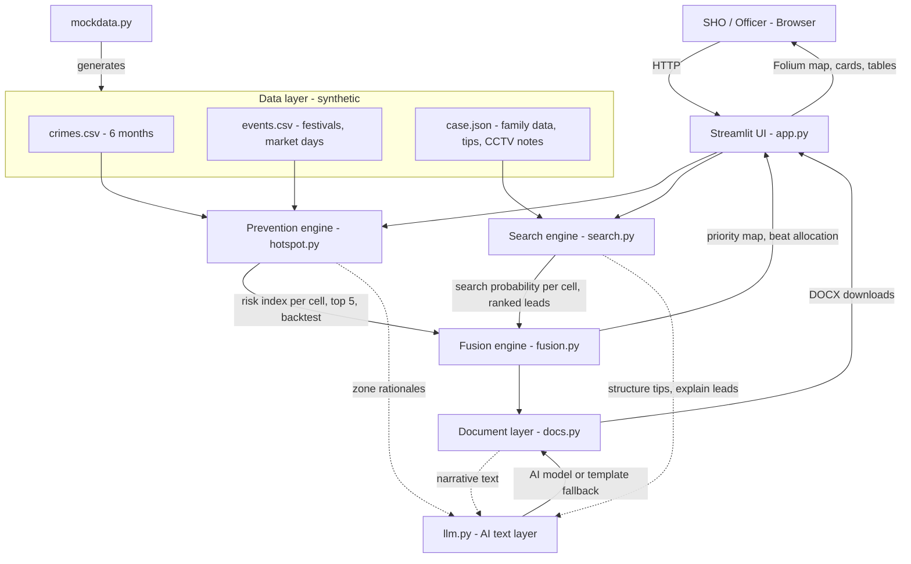

# Architecture

## System Architecture

GoldenHour Grid is a single-process Python application. A Streamlit UI calls three deterministic engines (prevention, search, fusion). A document layer turns their output into reports. AI is used only for language tasks (structuring messy tips, writing rationales and documents) and is isolated behind one module (`llm.py`) with an offline template fallback.

**Design principle: hybrid reasoning.** Code computes every number (risk index, search probability, priority, allocation) so results are reproducible and auditable. The AI writes and explains but never produces the scores.

## Components

| Component | Technology | Responsibility |
|---|---|---|
| Development assistant | IBM Bob | Scaffolded the project, generated the modules, helped debug and refine the UI |
| Frontend | Streamlit, Folium (streamlit-folium) | Three tabs (Prevention, Search, SHO Brief), interactive map with layer toggle and time slider, downloads |
| Data generator | Python, pandas, numpy (`mockdata.py`) | Creates 6 months of synthetic crime data with planted patterns, an event calendar and one fictional missing-person case |
| Prevention engine | Python, pandas (`hotspot.py`) | Recency-decayed, crime-weighted risk per 10x10 grid cell, day/hour peak matching, event multiplier, top 5 zones with rationale, backtest against a "same as last week" baseline |
| Search engine | Python, numpy (`search.py`) | Converts tips and CCTV sightings to structured records, scores credibility and movement feasibility, grows a search-probability grid with elapsed time, ranks leads with next actions |
| Fusion engine | Python (`fusion.py`) | Computes `priority = P_search x (1 + 0.5 x risk_norm)` and greedily allocates available beats to top cells with time windows |
| AI layer | LLM behind `llm.py` (provider configurable) with template fallback | Structures free-text tips, writes zone and lead rationales, drafts the brief, appeal notice and case file |
| Document layer | python-docx (`docs.py`) | Generates the SHO patrol brief, public appeal notice and pre-filled missing-person case file |
| Storage | CSV and JSON files in `data/` | Holds synthetic inputs; no database needed for the prototype |

## Data Flow

1. `mockdata.py` generates `crimes.csv`, `events.csv` and `case.json` (fictional district, fictional people, 1 Apr to 27 Sep 2026).
2. On load, the UI reads these files (cached) and the officer picks the target week, number of available beats and hours since the person was last seen.
3. **Prevention path:** `hotspot.py` scores every grid cell, applies the day/hour match and event multiplier, and returns the top 5 zones with a rationale. A backtest trains on earlier weeks and compares the top-5 hit rate with the baseline.
4. **Search path:** `search.py` turns each tip and CCTV sighting into a structured record, checks whether the movement is physically feasible from the previous sighting, down-ranks contradictory or low-credibility items, and expands the probability grid from the latest credible point as time passes, with a boost at transit nodes.
5. **Fusion:** `fusion.py` multiplies search probability by the risk layer and assigns beats to the highest-priority cells with time windows.
6. **AI text:** `llm.py` turns the computed results into plain-language rationales and document text. If no AI service is reachable, the same fields are filled from templates.
7. **Output:** the UI shows the map (risk, search or fused layer), ranked leads and zone cards. `docs.py` builds three DOCX files for download.

## Security Considerations

- **Synthetic data only.** No real personal, crime or child data is used or stored.
- API keys and endpoints for any AI service are read from environment variables and are never committed to git.
- The public appeal notice excludes home address and family phone number, and the UI tells the officer to review it before publishing.
- Every AI-written document is a draft for officer review; nothing is published or filed automatically.
- Outputs are labelled as a relative risk index and a resource-allocation aid, not a judgement about people or neighbourhoods.
- The `llm.py` fallback means the app works fully offline, so no data has to leave the machine for the demo.

## Scalability Notes

The prototype is a single stateless Streamlit process reading local files. To move beyond a hackathon demo:

- Replace CSV/JSON with a spatial database (for example PostgreSQL with PostGIS) fed from real CCTNS and ZIPNET data.
- Move the engines behind an API service (for example FastAPI) so several police stations can share them, and cache risk grids per week.
- Replace the fixed 10x10 grid with a finer or road-network-based grid, and calibrate the relative risk index into true probabilities using historical data.
- Batch and cache AI calls, since text generation is the slowest step.
- Add role-based access, audit logs of who viewed or generated what, and a fairness audit for the patrol feedback loop (more patrols leads to more recorded crime).

## Known Limitations

- The risk score is a relative index, not a calibrated probability.
- The backtest runs on synthetic data with planted patterns, so it shows how the method behaves, not how it performs on real crime.
- The search model uses simple speed and radius assumptions rather than real road networks.
